# PosterSplit

  <a href="https://apps.apple.com/app/id6793980696"><strong>Download on the App Store</strong></a>
  ·
  <a href="http://postersplit.net/">Official Website</a>
  ·
  <a href="http://postersplit.net/support.html">Support</a>
  ·
  <a href="http://postersplit.net/privacy.html">Privacy Policy</a>

  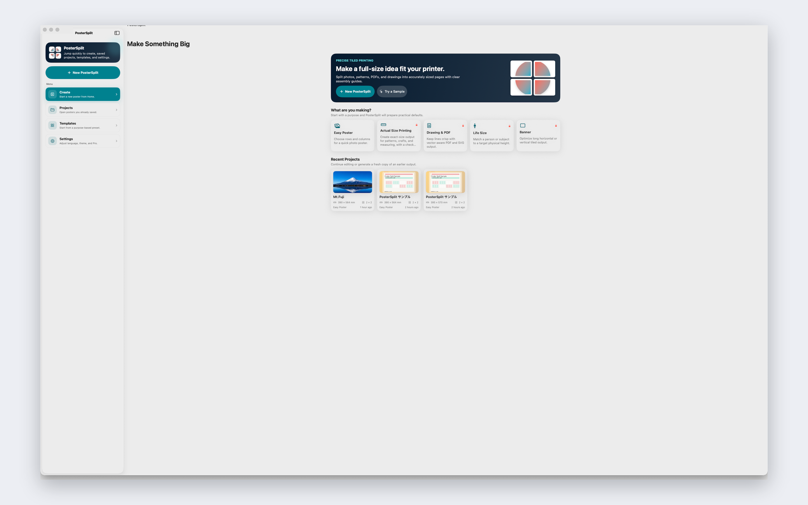
  
  

## Large posters from the printer you already own.

PosterSplit turns a single image, PDF, or SVG into accurately tiled pages for a home or office printer. Choose a paper size, finished size, or scale; preview the layout before printing; and export an assembly-ready PDF for posters, templates, drawings, signs, and large-format displays.

> English is the canonical version of this README. Localized sections are provided so users can understand PosterSplit in their own language.

> This repository is an official promotional README and screenshot kit for PosterSplit. It is not intended to publish the app source code.

## What PosterSplit helps you do

- Split photos, PDFs, and SVGs into printable pages.
- Build posters, sewing patterns, craft templates, drawings, signs, and banners.
- Work from a paper grid, finished dimensions, real-size scale, or drawing/PDF workflow.
- Adjust margins, overlap, crop marks, page labels, and assembly guides.
- Preview page count, final dimensions, and resolution before exporting.
- Export print-ready PDFs for AirPrint, sharing, or file saving.
- Use calibration tools to make real-size printing easier.
- Work across Mac, iPhone, and iPad.

## Why it exists

Printing large things on ordinary paper is easy to get almost right — and frustrating to get wrong. PosterSplit is built to reduce the “I noticed after printing” moments by showing page count, layout, overlap, and final size before you commit paper and ink.

## App links

- App Store: [PosterSplit](https://apps.apple.com/app/id6793980696)
- Official website: [http://postersplit.net/](http://postersplit.net/)
- Support: [http://postersplit.net/support.html](http://postersplit.net/support.html)
- Privacy Policy: [http://postersplit.net/privacy.html](http://postersplit.net/privacy.html)
- Contact: [support@postersplit.net](mailto:support@postersplit.net)

## Localized overview and screenshots

<strong>English</strong>

### Large posters from the printer you already own.

PosterSplit turns images, PDFs, and SVGs into tiled, print-ready PDFs. Choose paper, finished size, or scale; preview every page; add overlap and assembly guides; then export a file you can print and assemble with confidence.

  
  
  

<strong>日本語</strong>

### 大きなポスターを、いつものプリンターで。

PosterSplitは、写真・PDF・SVGを用紙サイズに合わせて分割し、貼り合わせやすいPDFとして書き出すアプリです。家庭用・オフィスプリンターで、ポスター、実寸型紙、図面、掲示物を作成できます。

  
  
  

<strong>Deutsch</strong>

### Große Poster mit dem Drucker, den du schon hast.

PosterSplit teilt Fotos, PDFs und SVGs passend zum Papierformat in druckfertige PDF-Seiten auf. Wähle Papier, Endgröße oder Maßstab, prüfe die Vorschau und exportiere eine Datei, die sich leicht zusammensetzen lässt.

  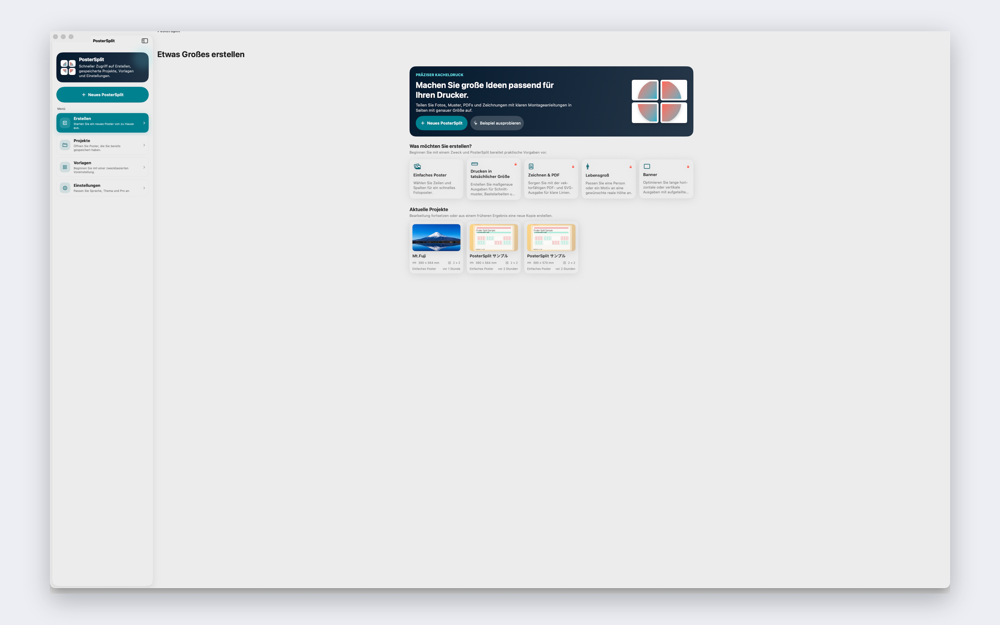
  
  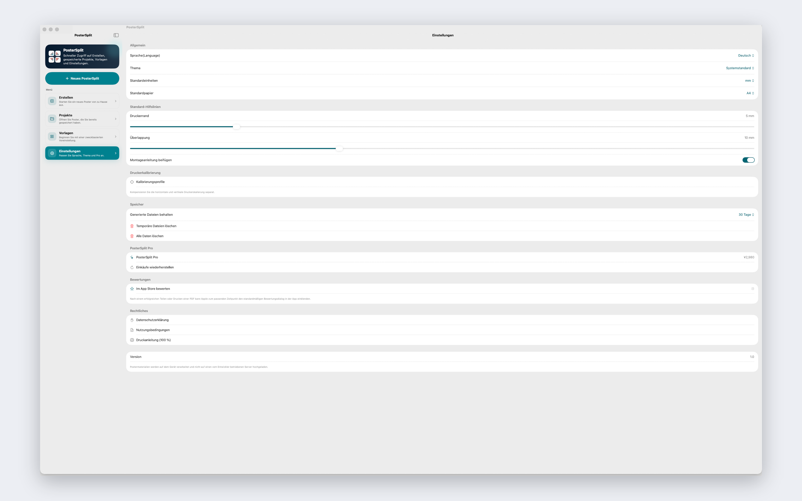

<strong>Español</strong>

### Pósters grandes con la impresora que ya tienes.

PosterSplit divide fotos, PDF y SVG en páginas listas para imprimir según el papel elegido. Ajusta el tamaño final o la escala, revisa la vista previa y exporta un PDF fácil de montar.

  
  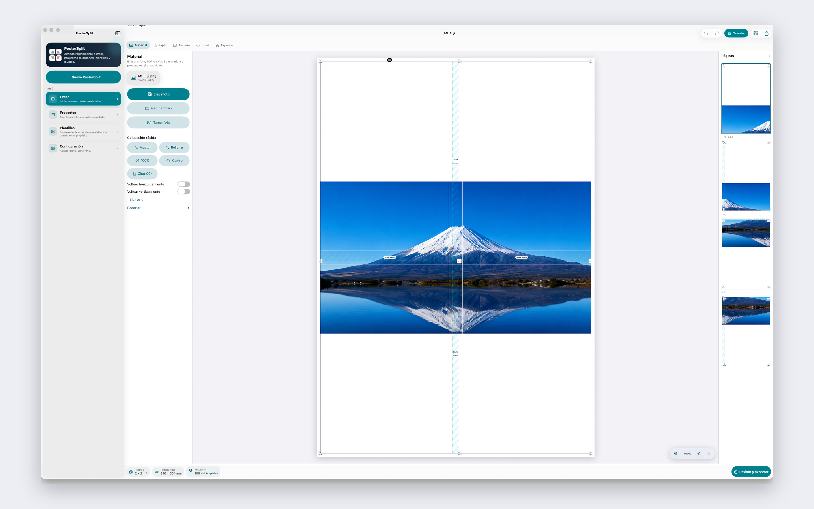
  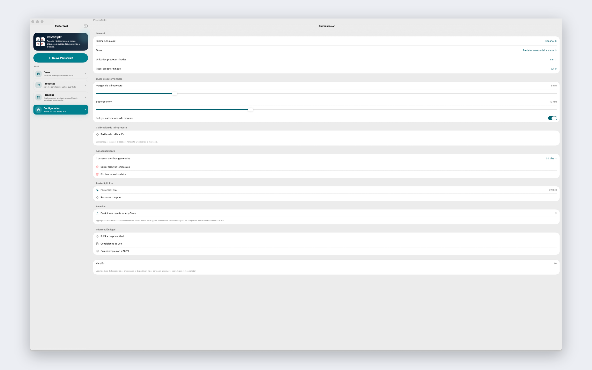

<strong>Français</strong>

### De grands posters avec l’imprimante que vous avez déjà.

PosterSplit découpe photos, PDF et SVG en pages PDF prêtes à imprimer, adaptées au format du papier. Choisissez le papier, la taille finale ou l’échelle, vérifiez l’aperçu, puis exportez un fichier facile à assembler.

  
  
  

<strong>Italiano</strong>

### Poster grandi con la stampante che hai già.

PosterSplit divide foto, PDF e SVG in pagine PDF pronte per la stampa in base al formato carta. Scegli carta, dimensione finale o scala, controlla l’anteprima ed esporta un file facile da assemblare.

  
  
  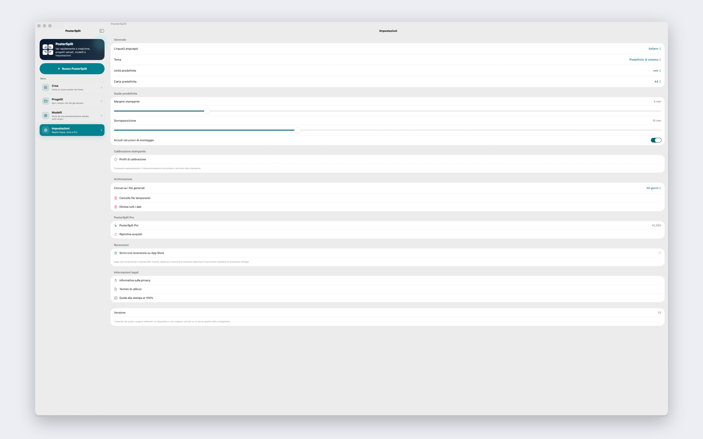

<strong>한국어</strong>

### 이미 가지고 있는 프린터로 큰 포스터를 만드세요.

PosterSplit은 사진, PDF, SVG를 선택한 용지 크기에 맞춰 여러 페이지의 인쇄용 PDF로 나눕니다. 용지, 완성 크기 또는 배율을 정하고 미리 본 뒤 조립하기 쉬운 PDF로 내보낼 수 있습니다.

  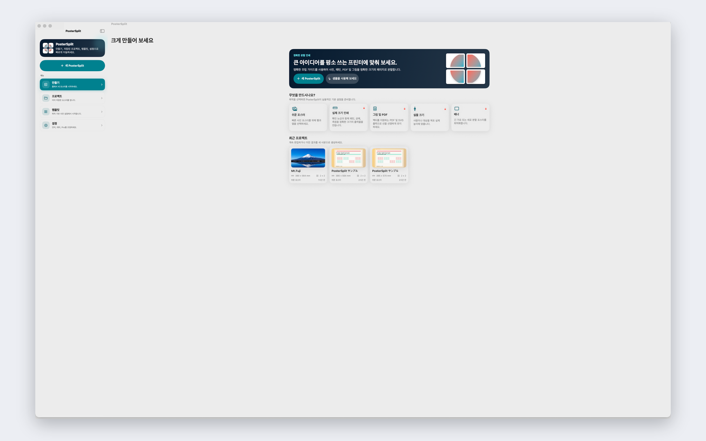
  
  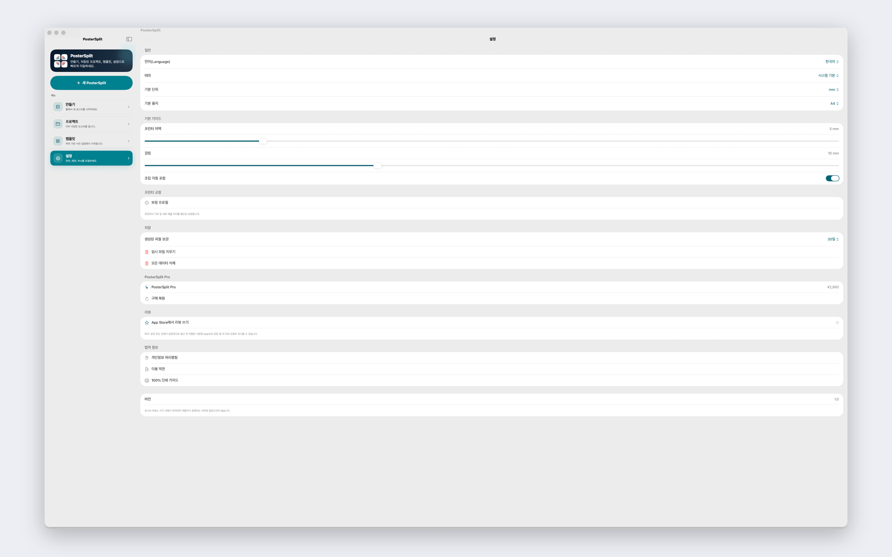

<strong>Português (Brasil)</strong>

### Cartazes grandes com a impressora que você já tem.

PosterSplit divide fotos, PDFs e SVGs em páginas prontas para impressão, de acordo com o papel escolhido. Defina papel, tamanho final ou escala, confira a prévia e exporte um PDF fácil de montar.

  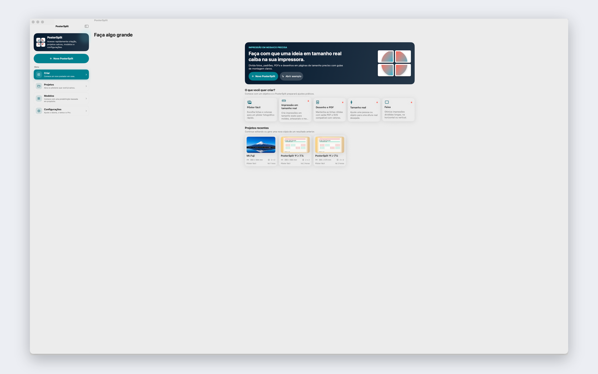
  
  

<strong>Русский</strong>

### Большие постеры на принтере, который уже есть.

PosterSplit разбивает изображения, PDF и SVG на страницы PDF, готовые к печати под выбранный формат бумаги. Выберите бумагу, итоговый размер или масштаб, проверьте предпросмотр и экспортируйте файл для удобной сборки.

  
  
  

<strong>简体中文</strong>

### 用现有打印机制作大幅海报。

PosterSplit 可将照片、PDF 和 SVG 按纸张尺寸分割为可打印的 PDF 页面。选择纸张、成品尺寸或比例，预览每一页，然后导出便于拼接的文件。

  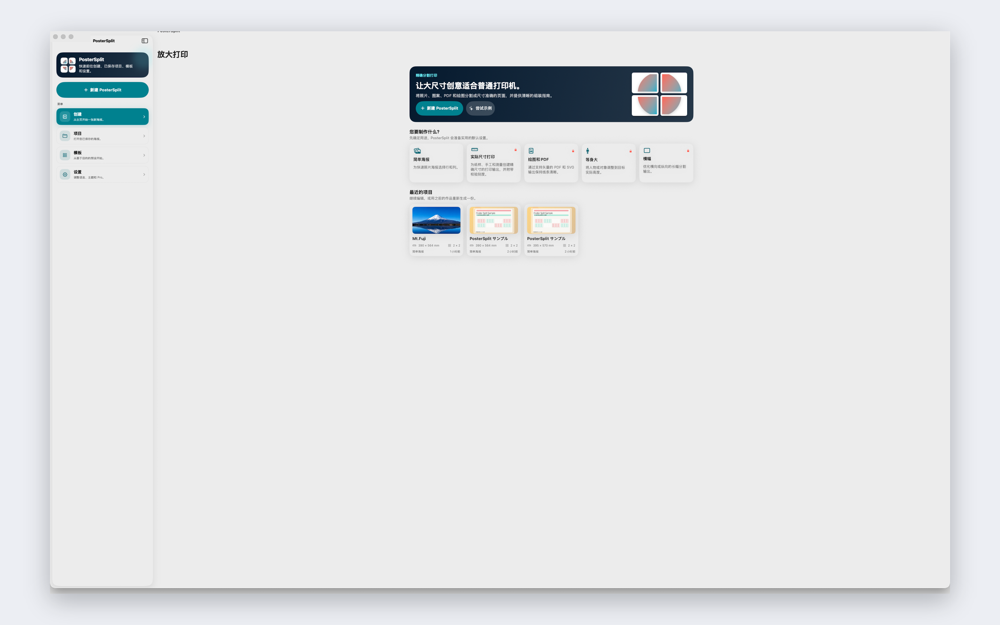
  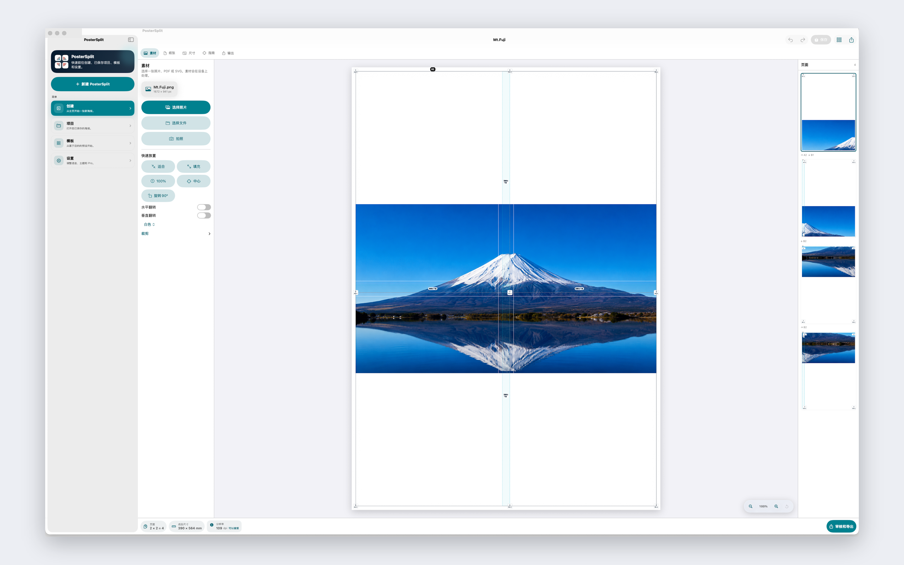
  

<strong>繁體中文</strong>

### 用現有印表機製作大幅海報。

PosterSplit 可將照片、PDF 與 SVG 依紙張尺寸分割成可列印的 PDF 頁面。選擇紙張、成品尺寸或比例，預覽每一頁，然後匯出方便拼接的檔案。

  
  
  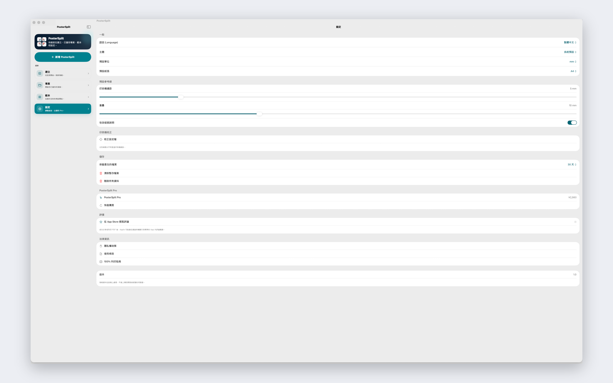

---

PosterSplit is developed by ikojiro. Apple, Mac, iPhone, iPad, App Store, and AirPrint are trademarks of Apple Inc.
